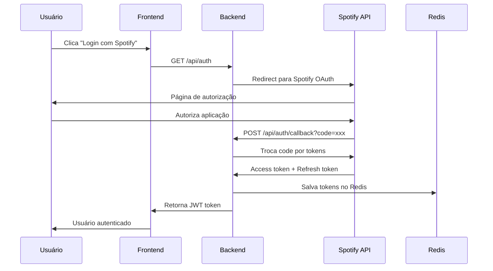
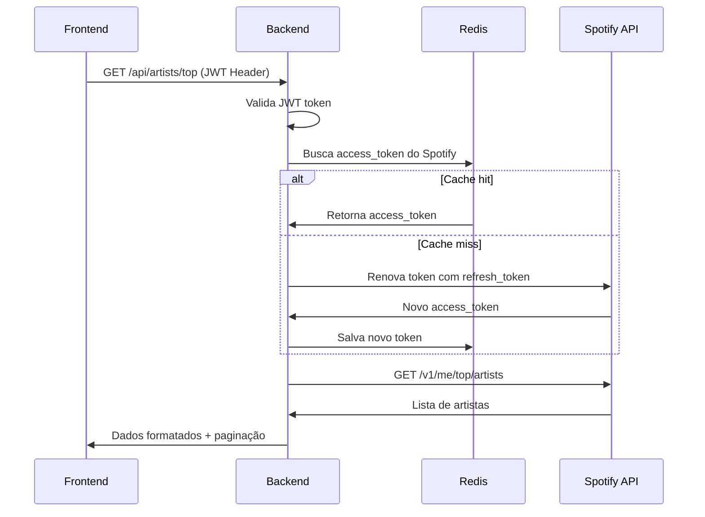
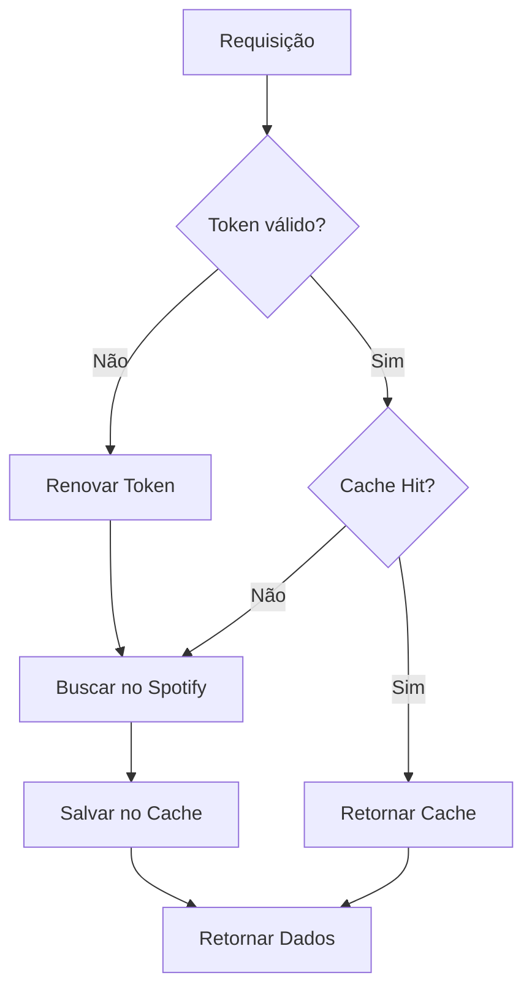

# Spotify API Backend

Uma API robusta e escalável para integração com o Spotify, desenvolvida com Node.js, TypeScript e Fastify. Esta aplicação permite autenticação via Spotify, gerenciamento de artistas, álbuns e playlists com funcionalidades avançadas de cache e paginação.

## Índice

- [Tecnologias](#tecnologias)
- [Funcionalidades](#funcionalidades)
- [Requisitos do Projeto](#requisitos-do-projeto)
- [Arquitetura](#arquitetura)
- [Instalação](#instalação)
- [Configuração](#configuração)
- [API Endpoints](#api-endpoints)
- [Fluxo de Requisições](#fluxo-de-requisições)
- [Deploy](#deploy)
- [Testes](#testes)
- [Segurança](#segurança)
- [Performance](#performance)
- [Contribuição](#contribuição)

## Tecnologias

### Backend
- **Node.js 22** - Runtime JavaScript
- **TypeScript** - Tipagem estática
- **Fastify** - Framework web rápido e eficiente
- **Zod** - Validação de schemas e tipos
- **JWT** - Autenticação e autorização
- **Redis** - Cache e armazenamento de sessões
- **Jest** - Framework de testes

### Ferramentas de Desenvolvimento
- **Biome** - Linter e formatter
- **tsup** - Build tool otimizado para TypeScript
- **Docker** - Containerização
- **Docker Compose** - Orquestração de containers
- **Swagger/OpenAPI** - Documentação da API

## Funcionalidades

### ✅ Implementadas
- [x] **Autenticação via Spotify** - OAuth 2.0 flow
- [x] **Listar artistas** - Top artistas do usuário
- [x] **Listar álbuns de artista** - Com paginação
- [x] **Gerenciamento de playlists** - Criar e listar playlists
- [x] **Dados do usuário** - Perfil e informações
- [x] **Cache Redis** - Performance otimizada
- [x] **Paginação** - Scroll infinito implementado
- [x] **Testes unitários** - Cobertura abrangente
- [x] **Lint** - Qualidade de código
- [x] **Documentação API** - Swagger UI
- [x] **Containerização** - Docker para produção

### 🔄 Em Desenvolvimento
- [ ] **Funcionamento offline** - Service Worker
- [ ] **Testes E2E** - Cypress/Playwright
- [ ] **Integração Sentry** - Monitoramento de erros
- [ ] **CI/CD** - GitHub Actions
- [ ] **PWA** - Progressive Web App
- [ ] **SonarQube** - Análise de qualidade

## Requisitos do Projeto

#### ✅ Requisitos Implementados
- [x] **Segmentação de commits** - Conventional Commits
- [x] **Lint** - Biome configurado
- [x] **Autenticação via Spotify** - OAuth 2.0 implementado
- [x] **Listar artistas** - Top artistas com paginação
- [x] **Listar álbuns de um artista** - Com cache e paginação
- [x] **Utilizar paginação** - Scroll infinito implementado
- [x] **Testes unitários** - Jest com cobertura
- [x] **Deploy da aplicação** - Docker + Docker Compose

#### 🔄 Em Desenvolvimento
- [ ] **Funcionamento offline** - Service Worker + Cache API
- [ ] **Testes E2E** - Cypress/Playwright
- [ ] **Integração com Sentry** - Monitoramento de erros
- [ ] **CI/CD** - GitHub Actions pipeline
- [ ] **Responsividade** - Frontend responsivo
- [ ] **Qualidade de código** - SonarQube integration
- [ ] **PWA** - Progressive Web App

## Arquitetura

```
┌─────────────────┐    ┌─────────────────┐    ┌─────────────────┐
│   Frontend      │    │   Backend API   │    │   Spotify API   │
│   (React/Vue)   │◄──►│   (Fastify)     │◄──►│   (External)    │
└─────────────────┘    └─────────────────┘    └─────────────────┘
                              │
                              ▼
                       ┌─────────────────┐
                       │   Redis Cache   │
                       │   (Sessions)    │
                       └─────────────────┘
```

### Padrões Arquiteturais
- **Clean Architecture** - Separação de responsabilidades
- **Repository Pattern** - Abstração de dados
- **Service Layer** - Lógica de negócio
- **Middleware Pattern** - Interceptação de requisições
- **Error Handling** - Tratamento centralizado de erros
- **Multi-stage Docker Build** - Otimização para produção

## Instalação

### Pré-requisitos
- Node.js 22+
- npm ou yarn
- Docker e Docker Compose
- Redis (para produção)

### Desenvolvimento Local

```bash
# Clone o repositório
git clone <repository-url>
cd spotify-API-backend

# Instale as dependências
npm install

# Configure as variáveis de ambiente
cp .env.example .env
# Edite o arquivo .env com suas credenciais do Spotify

# Inicie o Redis (se não estiver usando Docker)
redis-server

# Execute em modo desenvolvimento
npm run dev
```

### Com Docker (Desenvolvimento)

```bash
# Inicie os serviços
docker-compose -f docker-compose-dev.yml up -d

# Visualize os logs
docker-compose -f docker-compose-dev.yml logs -f app
```

### Build de Produção

```bash
# Build local
npm run build

# Build para produção
npm run build:prod
```

## Configuração

### Variáveis de Ambiente

Crie um arquivo `.env` na raiz do projeto:

```env
# Servidor
PORT=3333
NODE_ENV=production

# Spotify API
SPOTIFY_CLIENT_ID=your_spotify_client_id
SPOTIFY_CLIENT_SECRET=your_spotify_client_secret
SPOTIFY_REDIRECT_URI=http://localhost:3333/api/auth/callback

# JWT
JWT_SECRET=your_super_secret_jwt_key

# Redis
REDIS_HOST=localhost
REDIS_PORT=6379
REDIS_PASSWORD=your_redis_password
```

### Configuração do Spotify App

1. Acesse [Spotify for Developers](https://developer.spotify.com/dashboard)
2. Crie uma nova aplicação
3. Configure as URLs de redirecionamento
4. Copie o Client ID e Client Secret

## API Endpoints

### Autenticação
| Método | Endpoint | Descrição |
|--------|----------|-----------|
| `GET` | `/api/auth` | Iniciar fluxo OAuth |
| `POST` | `/api/auth/callback` | Callback OAuth |
| `GET` | `/api/auth/me` | Dados do usuário |
| `POST` | `/api/auth/refresh` | Renovar token |

### Artistas
| Método | Endpoint | Descrição |
|--------|----------|-----------|
| `GET` | `/api/artists/top` | Top artistas do usuário |
| `GET` | `/api/artists/:id/albums` | Álbuns de um artista |

### Playlists
| Método | Endpoint | Descrição |
|--------|----------|-----------|
| `GET` | `/api/playlists` | Playlists do usuário |
| `POST` | `/api/playlists` | Criar nova playlist |

### Sistema
| Método | Endpoint | Descrição |
|--------|----------|-----------|
| `GET` | `/api/health` | Health check |

### Documentação Interativa
- **Swagger UI**: `http://localhost:3333/api/docs`

## Fluxo de Requisições

### 1. Autenticação OAuth


### 2. Requisição Autenticada


### 3. Cache Strategy


## Deploy

### Docker Compose (Produção)

```bash
# Build e deploy
docker-compose up -d --build

# Verificar status
docker-compose ps

# Visualizar logs
docker-compose logs -f app
```

### Docker Build Manual

```bash
# Build da imagem
docker build -t spotify-api-backend .

# Executar container
docker run -d \
  --name spotify-api \
  -p 3333:3333 \
  --env-file .env \
  --network spotify-network \
  spotify-api-backend
```

### Características do Build

- **tsup**: Build tool otimizado que lida automaticamente com imports `.ts`
- **Multi-stage**: Build otimizado com imagem final mínima
- **Esm Output**: Compatível com Node.js moderno
- **Zero Config**: Configuração automática para TypeScript

### Variáveis de Ambiente para Produção

```env
NODE_ENV=production
PORT=3333
SPOTIFY_REDIRECT_URI=https://yourdomain.com/api/auth/callback
REDIS_HOST=redis
REDIS_PASSWORD=strong_redis_password
JWT_SECRET=very_strong_jwt_secret_key
```

## Testes

### Executar Testes
```bash
# Todos os testes
npm test

# Com cobertura
npm run test:coverage

# Testes em modo watch
npm test -- --watch
```

### Cobertura de Testes
- **Unitários**: Services, utilities, middlewares
- **Integração**: Routes, autenticação, cache

## Segurança

- **JWT Tokens** - Autenticação stateless
- **HTTPS** - Comunicação criptografada
- **CORS** - Controle de origem
- **Rate Limiting** - Prevenção de abuso
- **Input Validation** - Zod schemas
- **Environment Variables** - Credenciais seguras

## Performance

- **Redis Cache** - Reduz chamadas à API Spotify
- **Connection Pooling** - Reutilização de conexões
- **Compression** - Gzip habilitado
- **Health Checks** - Monitoramento de saúde
- **Graceful Shutdown** - Finalização limpa
- **tsup Build** - Bundle otimizado para produção
- **Multi-stage Docker** - Imagem final otimizada

## Contribuição

1. Fork o projeto
2. Crie uma branch para sua feature (`git checkout -b feature/AmazingFeature`)
3. Commit suas mudanças (`git commit -m 'Add some AmazingFeature'`)
4. Push para a branch (`git push origin feature/AmazingFeature`)
5. Abra um Pull Request

### Padrões de Commit
```
feat: adiciona nova funcionalidade/testes
fix: corrige bug
docs: atualiza documentação
style: formatação de código
refactor: refatoração de código
chore: tarefas de build/configuração
```

## Licença

Este projeto está sob a licença MIT. Veja o arquivo [LICENSE](LICENSE) para mais detalhes.

## Desenvolvedor

 [Maiko Defreyn](https://github.com/deCODEyn)

---

⭐ **Se este projeto foi útil para você, considere dar uma estrela!**
